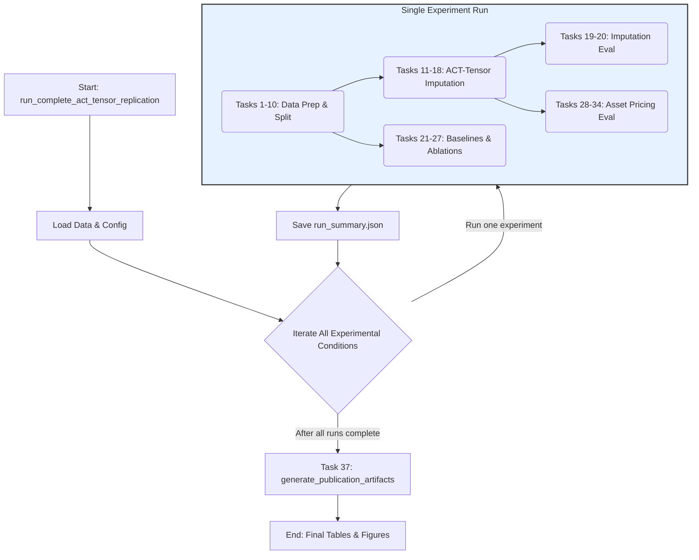

# `README.md`

# ACT-Tensor: A Complete Implementation of the Tensor Completion Framework for Financial Dataset Imputation

<!-- PROJECT SHIELDS -->
[](https://opensource.org/licenses/MIT)
[](https://www.python.org/)
[](https://arxiv.org/abs/2508.01861)
[](https://icaif.acm.org/2025/)
[](https://github.com/chirindaopensource/act_tensor)
[](https://github.com/chirindaopensource/act_tensor)
[](https://github.com/chirindaopensource/act_tensor)
[](https://github.com/chirindaopensource/act_tensor)
[](https://github.com/chirindaopensource/act_tensor)
[](https://github.com/psf/black)
[](http://mypy-lang.org/)
[](https://numpy.org/)
[](https://pandas.pydata.org/)
[](https://scikit-learn.org/)
[](https://scipy.org/)
[](http://tensorly.org/stable/index.html)
[](https://matplotlib.org/)
[](https://jupyter.org/)
---

**Repository:** `https://github.com/chirindaopensource/act_tensor`

**Owner:** 2025 Craig Chirinda (Open Source Projects)

This repository contains an **independent**, professional-grade Python implementation of the research methodology from the 2025 paper entitled **"ACT-Tensor: Tensor Completion Framework for Financial Dataset Imputation"** by:

*   Junyi Mo
*   Jiayu Li
*   Duo Zhang
*   Elynn Chen

The project provides a complete, end-to-end computational framework for replicating the paper's findings. It delivers a modular, auditable, and extensible pipeline that executes the entire research workflow: from rigorous data validation and characteristic engineering to the core tensor imputation algorithm and the final downstream asset pricing evaluation.

## Table of Contents

- [Introduction](#introduction)
- [Theoretical Background](#theoretical-background)
- [Features](#features)
- [Methodology Implemented](#methodology-implemented)
- [Core Components (Notebook Structure)](#core-components-notebook-structure)
- [Key Callable: `run_complete_act_tensor_replication`](#key-callable-run_complete_act_tensor_replication)
- [Workflow Diagram](#workflow-diagram)
- [Prerequisites](#prerequisites)
- [Installation](#installation)
- [Input Data Structure](#input-data-structure)
- [Usage](#usage)
- [Output Structure](#output-structure)
- [Project Structure](#project-structure)
- [Customization](#customization)
- [Contributing](#contributing)
- [Recommended Extensions](#recommended-extensions)
- [License](#license)
- [Citation](#citation)
- [Acknowledgments](#acknowledgments)

## Introduction

This project provides a Python implementation of the methodologies presented in the 2025 paper "ACT-Tensor: Tensor Completion Framework for Financial Dataset Imputation." The core of this repository is the iPython Notebook `act_tensor_draft.ipynb`, which contains a comprehensive suite of functions to replicate the paper's findings, from initial data validation to the final generation of all analytical tables and figures.

The paper introduces a novel tensor-based framework to address the pervasive problem of missing data in multi-dimensional financial panels. This codebase operationalizes the ACT-Tensor framework, allowing users to:
-   Rigorously validate and manage the entire experimental configuration via a single YAML file.
-   Process raw CRSP/Compustat data, construct a library of 45 firm characteristics with correct look-ahead bias handling, and transform the data into a 3D tensor.
-   Execute the core ACT-Tensor algorithm: K-Means clustering by data density, followed by a "divide and conquer" CP tensor completion and temporal smoothing.
-   Run a full suite of benchmark models, ablation studies, and sensitivity analyses.
-   Perform a complete downstream asset pricing evaluation to measure the economic significance of the imputed data.

## Theoretical Background

The implemented methods are grounded in multilinear algebra, machine learning, and empirical asset pricing.

**1. CP Tensor Decomposition:**
The core of the imputation model is the CANDECOMP/PARAFAC (CP) decomposition, which approximates a tensor $\mathcal{X}$ as a sum of rank-one tensors. For a 3D tensor, the model is:
$$
\hat{\mathcal{X}} = \sum_{r=1}^{R} \mathbf{u}_r \circ \mathbf{v}_r \circ \mathbf{w}_r
$$
where $\mathbf{U}$, $\mathbf{V}$, and $\mathbf{W}$ are factor matrices. The model is fit by minimizing the reconstruction error on the observed entries $\Omega$ via Alternating Least Squares (ALS).
$$
\min_{\mathbf{U},\mathbf{V},\mathbf{W}} \| \mathcal{P}_{\Omega}(\mathcal{X}) - \mathcal{P}_{\Omega}(\hat{\mathcal{X}}) \|_F^2
$$

**2. Cluster-Based Completion:**
To handle extreme sparsity, firms are first clustered by their data availability patterns using K-Means.
-   **Dense Clusters ($\rho_k \ge \tau$):** Imputed directly using the standard CP-ALS algorithm.
-   **Sparse Clusters ($\rho_k < \tau$):** Imputed by first forming an *augmented* tensor that combines the sparse firms with all dense firms, allowing the sparse firms to "borrow" statistical strength.

**3. Partial Tucker Decomposition (HOSVD):**
For the downstream asset pricing test, a large tensor of portfolio returns $\mathcal{R}$ is created. To extract a parsimonious set of factors, a partial Tucker decomposition is used, which is solved via the Higher-Order Singular Value Decomposition (HOSVD). This finds a low-dimensional core tensor $\mathcal{F}$ and loading matrices that best represent the original data.
$$
\mathcal{R} \approx \mathcal{F} \times_{1} U \times_{2} V \times_{3} W
$$

## Features

The provided iPython Notebook (`act_tensor_draft.ipynb`) implements the full research pipeline, including:

-   **Modular, Multi-Task Architecture:** The entire pipeline is broken down into over 30 distinct, modular tasks, each with its own orchestrator function, ensuring clarity and testability.
-   **Configuration-Driven Design:** All study parameters are managed in an external `config.yaml` file, allowing for easy customization and replication.
-   **High-Fidelity Financial Data Processing:** Includes professional-grade logic for handling CRSP/Compustat data, including look-ahead bias prevention, delisting return incorporation, and outlier cleansing.
-   **Robust Experimental Design:** Programmatically generates the three distinct missingness scenarios (MAR, Block, Logit) with disjoint test sets for rigorous model evaluation.
-   **From-Scratch Algorithm Implementation:** Includes a complete, from-scratch, regularized ALS solver for masked CP tensor decomposition with robust SVD-based initialization.
-   **Comprehensive Evaluation Suite:** Implements not only the main ACT-Tensor model but also all specified baselines, ablation studies, and sensitivity tests, and evaluates them on both statistical and economic metrics.
-   **Automated Reporting:** Concludes by automatically generating all publication-ready tables (including styled LaTeX with color-coding) and figures from the paper.

## Methodology Implemented

The core analytical steps directly implement the methodology from the paper:

1.  **Data Preparation (Tasks 1-6):** Ingests and validates the `config.yaml` and raw data, defines the study universe, constructs 45 characteristics with correct reporting lags, normalizes them, and forms the 3D tensor $\mathcal{X}$.
2.  **Experimental Design (Tasks 7-10):** Generates the three evaluation masks (MAR, Block, Logit) and creates the corresponding training tensors.
3.  **ACT-Tensor Imputation (Tasks 11-18):** Executes the full ACT-Tensor algorithm: K-Means clustering, density partitioning, dense and sparse cluster completion via CP-ALS, global assembly, and temporal smoothing (CMA, EMA, or KF).
4.  **Evaluation & Analysis (Tasks 19-27):** Evaluates the imputation accuracy of ACT-Tensor, all baselines, and all ablation models. Runs the regularization stability test.
5.  **Asset Pricing Pipeline (Tasks 28-34):** Uses the imputed data to construct double-sorted portfolios, extracts latent factors via HOSVD, selects predictive factors via forward stepwise regression, and computes all final asset pricing metrics (alphas, IC, Sharpe Ratio).
6.  **Master Orchestration (Tasks 35-37):** Provides top-level functions to run the entire experimental suite and automatically generate all final reports.

## Core Components (Notebook Structure)

The `act_tensor_draft.ipynb` notebook is structured as a logical pipeline with modular orchestrator functions for each of the major tasks. All functions are self-contained, fully documented with type hints and docstrings, and designed for professional-grade execution.

## Key Callable: `run_complete_act_tensor_replication`

The project is designed around a single, top-level user-facing interface function:

-   **`run_complete_act_tensor_replication`:** This master orchestrator function, located in the final section of the notebook, runs the entire automated research pipeline from end-to-end. A single call to this function reproduces the entire computational portion of the project, from data validation to the final report generation.

## Workflow Diagram

The following diagram illustrates the high-level workflow orchestrated by the `run_complete_act_tensor_replication` function.



## Prerequisites

-   Python 3.9+
-   Core dependencies: `pandas`, `numpy`, `scikit-learn`, `scipy`, `tensorly`, `matplotlib`, `seaborn`, `pyyaml`, `pyarrow`.

## Installation

1.  **Clone the repository:**
    ```sh
    git clone https://github.com/chirindaopensource/act_tensor.git
    cd act_tensor
    ```

2.  **Create and activate a virtual environment (recommended):**
    ```sh
    python -m venv venv
    source venv/bin/activate  # On Windows, use `venv\Scripts\activate`
    ```

3.  **Install Python dependencies:**
    ```sh
    pip install pandas numpy scikit-learn scipy tensorly matplotlib seaborn pyyaml pyarrow
    ```

## Input Data Structure

The pipeline requires a `pandas.DataFrame` with a specific, comprehensive schema containing merged CRSP and Compustat data. The exact schema is validated by the `validate_and_enforce_schema` function in the notebook. All other parameters are controlled by the `config.yaml` file.

## Usage

The `act_tensor_draft.ipynb` notebook provides a complete, step-by-step guide. The primary workflow is to execute the final cell of the notebook, which demonstrates how to use the top-level `run_complete_act_tensor_replication` orchestrator:

```python
# Final cell of the notebook

# This block serves as the main entry point for the entire project.
if __name__ == '__main__':
    # Define the paths to the necessary input files.
    # The user must provide their own raw data file in the specified format.
    # A synthetic data generator is included in the notebook for demonstration.
    RAW_DATA_FILE = "data/raw/crsp_compustat_merged.parquet"
    CONFIG_FILE = "config/act_tensor_config.yaml"
    
    # Define the top-level directory for all outputs.
    RESULTS_DIRECTORY = "replication_output"

    # Execute the entire replication study.
    run_complete_act_tensor_replication(
        data_path=RAW_DATA_FILE,
        config_path=CONFIG_FILE,
        base_output_dir=RESULTS_DIRECTORY
    )
```

## Output Structure

The pipeline creates a `base_output_dir` with a highly structured set of outputs. For each experimental run, a unique timestamped subdirectory is created, containing:
-   A detailed `pipeline_log.log` file.
-   A comprehensive `run_summary.json` with all computed metrics.
-   Subdirectories for all intermediate artifacts (e.g., `X_train.npz`, `cluster_assignments.csv`, `ap_ACT-Tensor_CMA/`).

At the top level, two final directories are created:
-   `final_tables/`: Contains all aggregated results in CSV and styled LaTeX formats.
-   `final_figures/`: Contains all generated plots in PDF format.

## Project Structure

```
act_tensor/
│
├── act_tensor_draft.ipynb    # Main implementation notebook with all 38 tasks
├── config.yaml               # Master configuration file
├── data/
│   └── raw/
│       └── crsp_compustat_merged.parquet (User-provided)
│
├── replication_output/       # Example output directory
│   ├── final_tables/
│   ├── final_figures/
│   └── MAR_CMA_20251026_103000/
│       ├── run_summary.json
│       └── ...
│
├── LICENSE
└── README.md
```

## Customization

The pipeline is highly customizable via the `config.yaml` file. Users can easily modify all study parameters, including date ranges, model hyperparameters (ranks, clusters), smoother settings, and asset pricing specifications, without altering the core Python code.

## Contributing

Contributions are welcome. Please fork the repository, create a feature branch, and submit a pull request with a clear description of your changes. Adherence to PEP 8, type hinting, and comprehensive docstrings is required.

## Recommended Extensions

Future extensions could include:
-   **Alternative Decompositions:** Integrating other tensor decompositions like the Tucker model or Tensor Train (TT) into the imputation framework.
-   **GPU Acceleration:** Adapting the core numerical algorithms (ALS, SVD) to run on GPUs using libraries like CuPy or PyTorch for significant speedups.
-   **Advanced Clustering:** Exploring more sophisticated clustering methods beyond K-Means, such as hierarchical clustering or density-based methods (DBSCAN).
-   **Dynamic Factor Models:** Extending the downstream asset pricing evaluation to use dynamic factor models that can capture time-varying factor loadings.

## License

This project is licensed under the MIT License.

## Citation

If you use this code or the methodology in your research, please cite the original paper:

```bibtex
@inproceedings{mo2025act,
  author    = {Mo, Junyi and Li, Jiayu and Zhang, Duo and Chen, Elynn},
  title     = {{ACT-Tensor: Tensor Completion Framework for Financial Dataset Imputation}},
  booktitle = {Proceedings of the 6th ACM International Conference on AI in Finance},
  series    = {ICAIF '25},
  year      = {2025},
  publisher = {ACM},
  note      = {arXiv:2508.01861}
}
```

For the implementation itself, you may cite this repository:
```
Chirinda, C. (2025). A Professional-Grade Implementation of the ACT-Tensor Framework.
GitHub repository: https://github.com/chirindaopensource/act_tensor
```

## Acknowledgments

-   Credit to **Junyi Mo, Jiayu Li, Duo Zhang, and Elynn Chen** for the foundational research that forms the entire basis for this computational replication.
-   This project is built upon the exceptional tools provided by the open-source community. Sincere thanks to the developers of the scientific Python ecosystem, including **Pandas, NumPy, Scikit-learn, SciPy, TensorLy, Matplotlib, and Jupyter**.

--

*This README was generated based on the structure and content of the `act_tensor_draft.ipynb` notebook and follows best practices for research software documentation.*
